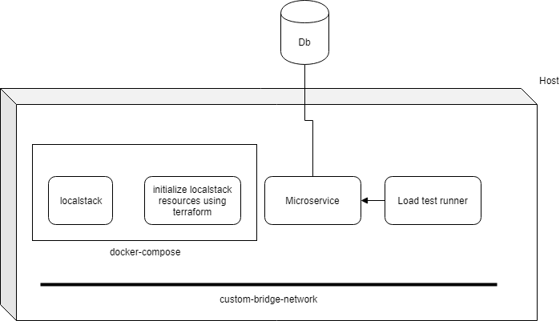

## Running multiple docker containers on a single host

 
 
The four containers shown in the diagram below are :

LocalStack container - Localstack mocks AWS resources so that you dont incur AWS costs when running tests. The localstack docker container starts up okay, but with a bunch of errors. 

LocalStack initialization container - This container waits for LocalStack to be up, and then use terraform to initialize localstack with the mock s3, dynamodb tables, sqs queues, etc needed by the microservice.

Docker Compose can be used to start up the above containers. For some reason, I had problem with getting docker compose to use a pre-defined network. Hence, I let docker compose create a bridge network(by specifying a project name).

Microservice container - This container exposes the core business functionality that needs to be tested. This container joins the above bridge network. 

TestRunner container - This container has Gradle and Java so that tests can be executed against the Microservice. It also joins the above bridge network. 

Using custom bridge network allows the test runner container to hit the http endpoints of the microservice container using http://<microservice-containername>. But note that the microservice will need to use docker compose service names for the reaching the endpoints exposed by the docker compose containers. 

Also, note that while all these containers can talk to each other when connected to the same custom bridge network, you still need to make note of the proxy settings specified in the container(at the unix layer or at the java application layer). These can still prevent connectivity unless you specify the docker container name or docker compose service in the no_proxy or -Dhttp.nonProxyHosts variables.

At the end, the microservice was able to use the S3 and Dynamodb endpoints on Localstack but couldnt connect to SQS port on localstack. This may be related to the startup errors seen in the localstack startup log.

