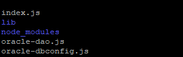

#### You will need
* Node 10.16.x. (Newer node version may not help because you may not easily find compatible oracledb package) 
* [NPM oracledb package](https://www.npmjs.com/package/oracledb)
* [Oracle Instant Client light linux version zip file](https://www.oracle.com/database/technologies/instant-client/downloads.html) 

### Creating your Lamdba deployment zip file

Let us assume your current working directory contains your lambda code in ```index.js```, but ultimately your ```dist``` folder will contain all the files that are to be deployed to lambda.
```
mkdir dist
cp index.js dist/
# Lambda already has the nodejs common libraries. You need to however copy over the oracledb library.
cp -R node_modules/oracledb/** dist/

# Binaries files needed by your nodejs libraries should go into the lib folder.
mkdir -p dist/lib
unzip /tmp/instantclient-basiclite-linux.x64-19.3.0.0.0dbru.zip -d dist/lib/

# The symlinks in dist/lib folder should be intact and not dereferenced.
cp -H /usr/lib64/libaio* dist/lib/

# Ensure rw permissions for lambda.
find . -type d -print0 |xargs -0 chmod 755
find . -type f -print0 |xargs -0 chmod 644
chmod 755 dist/lib/*.so

# Now zip up your entire dist folder
cd dist
zip ../xyz.zip --symlinks -r .

# Verify the zip file
zipinfo xyz.zip
```
Contents of your zip file should look similar to below.
 
 

Upload the zip file to s3 and have your lambda use the zip deployment package from s3.
