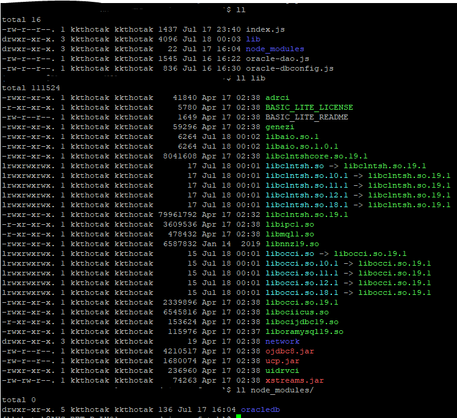

How to connect your AWS Lambda NodeJS application to connect to Oracle Database

Pre-reqs:

You are using Node 10.16.x 
Update package.json to pull in oracledb from NPM. Note: At this time, there is a binary available for Node 10.x but not for newer Node 12.x. Anyway, since AWS lambda comes with Node 10.x runtime, it is good to stick with Node 10.x

To create your lambda deployment zip , here are steps to follow.

1. Let us say your going to zip up everything in folder dist.
2. copy your lambda function code into dist.
3. copy node_modules/oracledb/** into dist. (You dont need other node modules that are already available via the lambda nodejs runtime)
4. Download oracle Instant Client from https://www.oracle.com/database/technologies/instant-client/downloads.html
   I picked the linux light version that comes in a zip file.
   Unpack the zip file to dist/lib folder.
   Make sure you are doing this in a unix environment so that the symlinks are maintained.
5. Find libaio* from your linux machine. They may be in /usr/lib64/. Copy the libaio.so symlink and the real file into your dist/lib folder.
6. Perform usual lambda checks. 
   Make sure all .so files in your dist/lib folder have 755 permissions.
   Make sure your lambda function code and node_modules/** have 644 permissions.
   Your dist folder should look like below.
7. zip up your entire dist folder, keeping symlinks intact.
   cd dist
   zip ../xyz.zip --symlinks -r .
8. Verify the zip. 
   zipinfo xyz.zip
9. upload your zip file to s3 and have your lambda using the package from s3.

 

